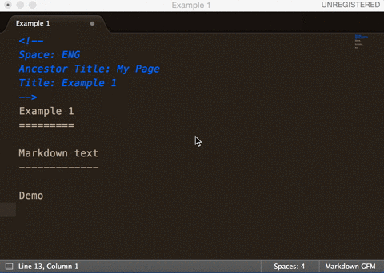

SublimeConfluence
=================

Sublime Text 3 plugin for integrate with Atlassian Confluence

Installation
------------

**Use sublime package manager**

 - you should use [sublime package manager][1]
 - use `cmd+shift+p` then `Package Control: Install Package`
 - look for `Confluence` and install it.

**Manually**

At the moment Git is required to install the plugin.  You will need
to clone the repository in your Sublime Text "Packages" directory:

`git clone git@github.com:mlf4aiur/SublimeConfluence.git "Confluence"`

The "Packages" directory is located at:

* OS X: `~/Library/Application Support/Sublime Text */Packages/`
* Linux: `~/.Sublime Text */Packages/`
* Windows: `%APPDATA%/Sublime Text */Packages/`

**Settings**

Add the following to your User Settings file:

```json
{
    "base_uri": "https://confluence.example.com/confluence/rest/api",
    "default_space_key": "ENG",
    "username": "username",
    "password": "password"
}
```

If the password unset, then you need to input the password every time, and don't edit the password inline this plugin can not handle it properly.

Usage
-----

**Demo:**



**Post page to Confluence**

Supported markup languages:

* Markdown, depends on [python-markdown2][0]
* reStructuredText, depends on docutils

META data must be given, and put it on the head of document, use newline to separate META data and content.

Example files: example.md, example.rst.

META data:

* Space
* Ancestor Title
* Title

Use Command Palette to run it, use `cmd+shift+p` then `Post page to Confluence` to post local page to remote.

BTW
---

Confluence supports buildin markup(Textile like) and markdown syntax insert. On the Confluence edit mode, press command + shift + D, to insert markup text.

License
-------

SublimeConfluence is [BSD Licensed](https://github.com/mlf4aiur/sublimetext-confluence-markup/master/LICENSE).

[0]: https://github.com/trentm/python-markdown2
[1]: https://packagecontrol.io
