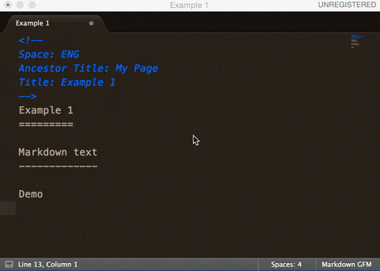

# SublimeConfluence

Sublime Text plugin for integrating with Atlassian Confluence

## Installation

### Use sublime package manager

- you should use [sublime package manager][1]
- use `cmd+shift+p` then `Package Control: Install Package`
- look for `Confluence` and install it.

### Manually

At the moment Git is required to install the plugin.  You will need
to clone the repository in your Sublime Text "Packages" directory:

`git clone git@github.com:mlf4aiur/SublimeConfluence.git "Confluence"`

The "Packages" directory is located at:

- OS X: `~/Library/Application Support/Sublime Text */Packages/`
- Linux: `~/.Sublime Text */Packages/`
- Windows: `%APPDATA%/Sublime Text */Packages/`

### Development

Use [uv](https://docs.astral.sh/uv/) to set up the dependencies for local
development:

```sh
uv sync
```

To enable reStructuredText support, install its optional dependency:

```sh
uv sync --extra rst
```

This development environment does not replace Package Control's dependency
installation for Sublime Text.

### Settings

Add the following to your User Settings file:

```json
{
    "base_uri": "https://confluence.example.com/confluence/rest/api",
    "default_space_key": "ENG",
    "username": "username",
    "password": "password",
    "verify_ssl": true
}
```

`verify_ssl` accepts either the boolean `true` (the default) or a quoted path
to a PEM CA bundle. For example:

```json
"verify_ssl": "/etc/ssl/certs/company-ca-bundle.pem"
```

On Windows, escape backslashes in the path, for example
`"verify_ssl": "C:\\Certificates\\company-ca-bundle.pem"`. Disabling
certificate verification is not recommended.

If the password is unset, you need to input it every time. Avoid editing the
password inline; this plugin cannot handle that correctly.

## Usage

### Demo



### Post page to Confluence

Supported markup languages:

- Markdown, depends on [python-markdown2][0]
- reStructuredText, depends on docutils

META data must be at the head of the document, separated from the content by a
newline.

Example files: example.md, example.rst.

META data:

- Space
- Ancestor Title
- Title

Use the Command Palette to run it: press `cmd+shift+p`, then choose
`Post page to Confluence` to post the local page remotely.

## BTW

Confluence supports built-in markup (Textile-like) and Markdown syntax insertion.
In Confluence edit mode, press `command+shift+D` to insert markup text.

## License

SublimeConfluence is [BSD Licensed](https://github.com/mlf4aiur/sublimetext-confluence-markup/master/LICENSE).

[0]: https://github.com/trentm/python-markdown2
[1]: https://packagecontrol.io
